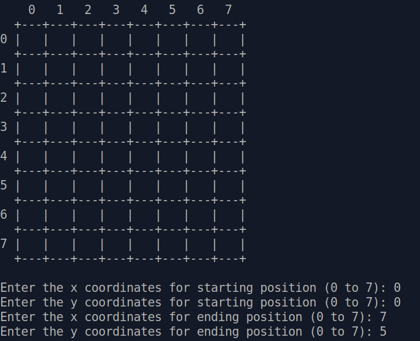
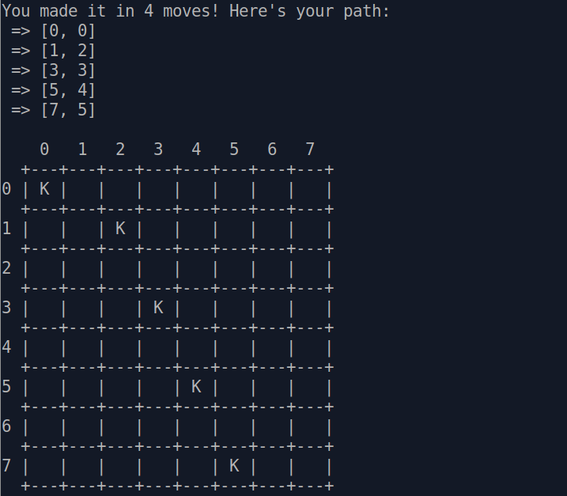

# Project: Data Structures and Algorithms
## Project 2: Knight’s Travails

### What's this

Ruby CLI program that takes a chess knight and returns the shortest possible route from one space to another.

For example:

- `knight_moves([0,0],[1,2]) #=> [[0,0],[1,2]]`
- `knight_moves([0,0],[3,3]) #=> [[0,0],[1,2],[3,3]]`
- `knight_moves([3,3],[0,0]) #=> [[3,3], [2,1], [0,0]]`
- `knight_moves([0,0],[7,7]) #=> [[0,0], [1,2], [0,4], [1,6], [3,7], [5,6], [7,7]]`

Example output:

    
    

This relatively easy exercise made me continuosly change approach, google and look for ideas outside, until I haven't grasped the relationship between `Knight` and `Board` classes. 

> *For this project, you’ll need to use a data structure that’s similar (but not identical) to a binary tree. For a summary of a few different examples, reference this article.*

My thought process went something like this:

Well... It seems logical that Graphs are the next logical step in our journey, since a Tree is a very specific type of Graph. In fact, a Tree is an Undirected Graph that has no cycles.

So, I started to read about Graph Theory and discover how to implement it in the wild. There are several ways to do this, including using an adjacency list or an adjacency matrix.

Hmmmm.... matrix visually is very similar to the chess playboard! The research is finished! The solution is found! Let’s jump right in! An apparently "obvious" implementation that actually will cause a world of dowstream pain. 

After some hours: it's not logical to put zeros for all the edges for 64 square board, when I need only max 8 possible moves. Not to mention some strong drawbacks from memory and time point of view.

OK. There is one other major way to represent graphs: adjacency list. So, what is an adjacency list? It’s simply a list of nodes that are adjacent to a given node. Wait... wait... very similar to a Linked List. Oh, I have that already! Let's use that!

Some more hours... Each square will have children, and then those children will be connected with edges, and then there are basic move of the Knight with their own edges... I was loosing my mind here... 

Long story short, I tried and re-tried different approaches, I learnt a lot about Graphs and its implementation, Dijkstra's algorithm in weighted and unweighted graphs, I was almost giving up... Until it hit me...

**Knight == Node, Board == Tree.**

Knight is a Node with its own children (potential moves) stored in an array (adjacency list), generated on the fly.  I don't even need a separate Tree/Graph class! I just need smth similar to the `@head` of linked list to backtrack what move generated the other. And that's it! So simple.

It was there all the time: 

> *Treat all possible moves the **knight could make as children** in a tree* 

After that eureka moment it was relatively easy in  programming.

RRROUND!